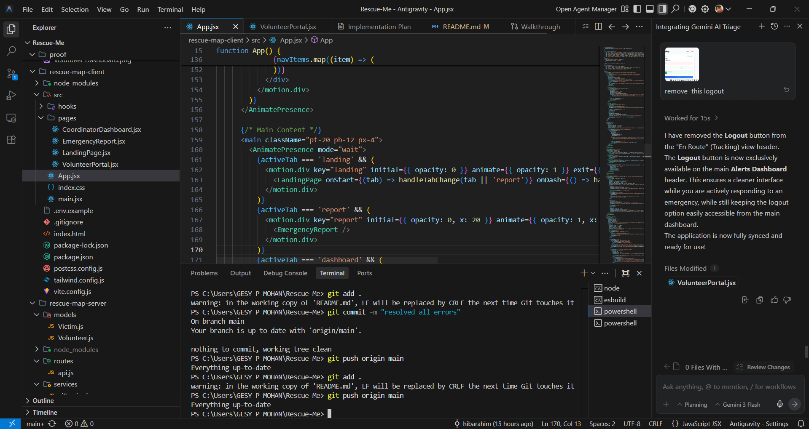
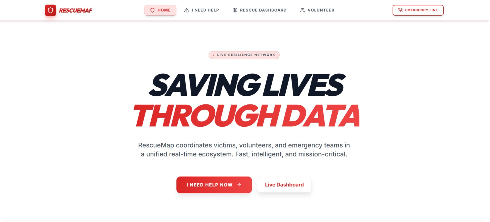
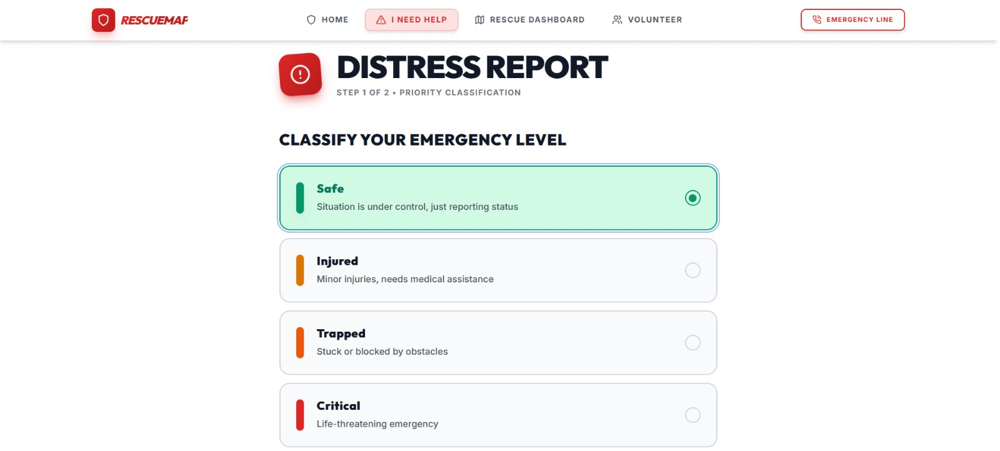
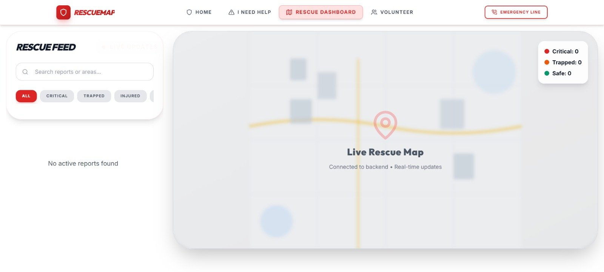
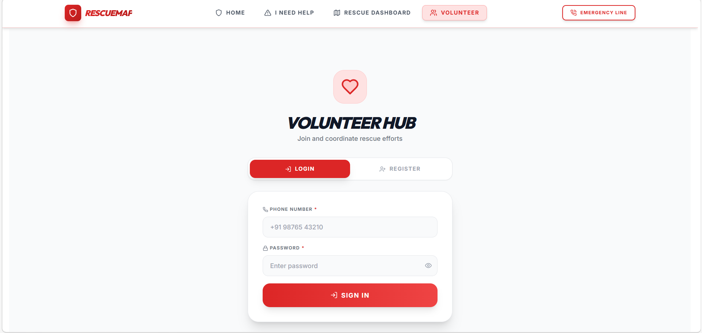

# Rescue Map 

**Team Name: F1**  
**Team Members:**  
- Arpitha Bhandary (S6 AI)  
- Ankita Syam (S6 CSE)

## Problem Statement
In disaster zones, traditional emergency response is often crippled by a lack of real-time visibility. Victims cannot easily communicate their exact GPS location or the severity of their situation, and rescue coordinators struggle to prioritize hundreds of incoming distress calls manually. This delay in "Triage" (prioritizing the most critical cases) leads to lost lives when every second counts.

## Project Description
**RescueMap** is a high-tech disaster response and coordination platform designed for real-time SOS management.  
- **Victim Portal**: Provides a seamless, one-tap SOS reporting system that captures GPS, severity, and situation details.
- **Coordinator Dashboard**: A Command & Control center that visualizes distress calls on an interactive map.
- **Smart Triage**: Uses AI to automatically prioritize victims based on the urgency of their descriptions.
- **Volunteer Portal**: Connects active volunteers with nearby rescue tasks, providing one-click navigation and contact.

## Google AI Usage
### Tools / Models Used
- **Gemini 1.5 Flash**: Chosen for its high speed and accuracy in text classification.

### How Google AI Was Used
Google Gemini is integrated as a **Smart Triage Engine**. When a victim submits a distress report, the description is sent to Gemini to analyze the level of danger. The AI:
1.  **Analyzes Distress Descriptions**: Understands complex language (e.g., "water is rising" vs "need food").
2.  **Generates Priority Scores**: Assigns a score (1-100) based on the immediate threat to life.
3.  **Verifies Severity**: Validates human-selected severity to ensure coordinators see the most critical reports first.

## Proof of Google AI Usage
All AI logic is located in: `rescue-map-server/services/aiService.js`



## Screenshots









## Demo Video
Watch the demo of RescueMap in action here:  
[Watch Demo](https://drive.google.com/file/d/1xSMAooCkwKKtqyTAN_tZlMkISPemxBMQ/view?usp=sharing)

## Installation Steps
### Clone the repository
```bash
git clone https://github.com/AnkitaSyam/Rescue-Map.git
```

### Go to project folder
```bash
cd Rescue-Map
```

### Install dependencies
```bash
# Server
cd rescue-map-server
npm install

# Client
cd ../rescue-map-client
npm install
```

### Run the project
```bash
# Server
cd rescue-map-server
npm start

# Client (in a new terminal)
cd rescue-map-client
npm run dev
```


